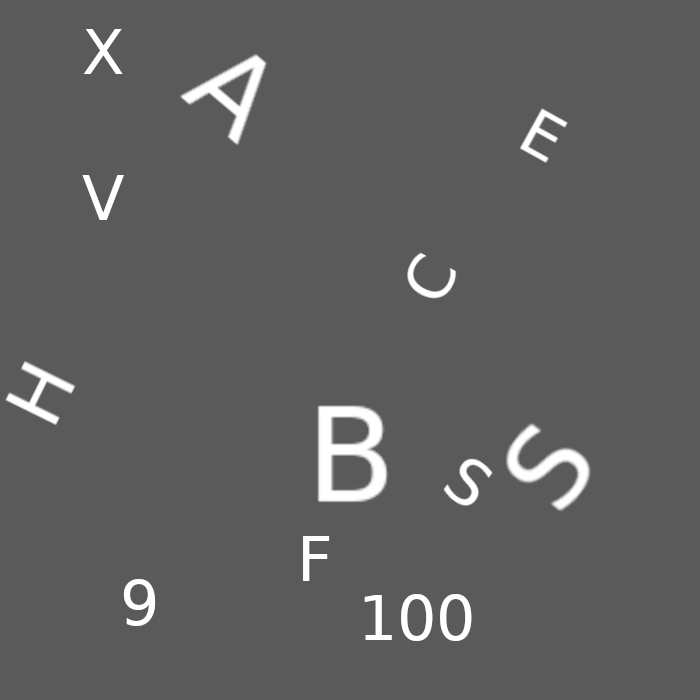
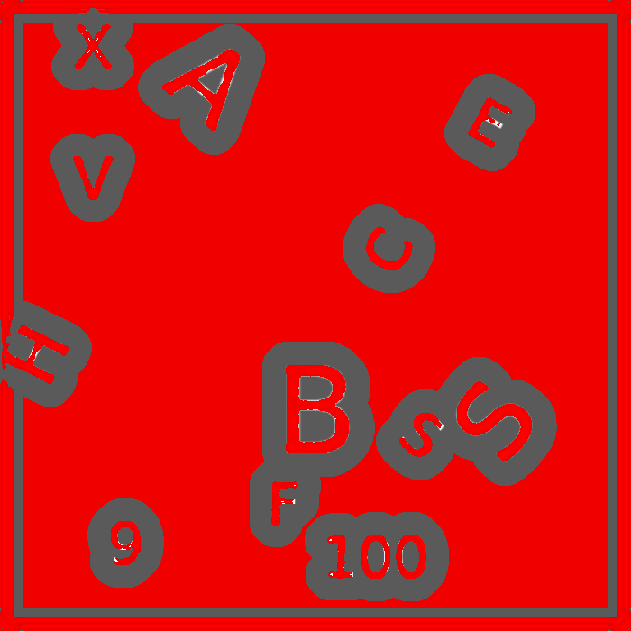
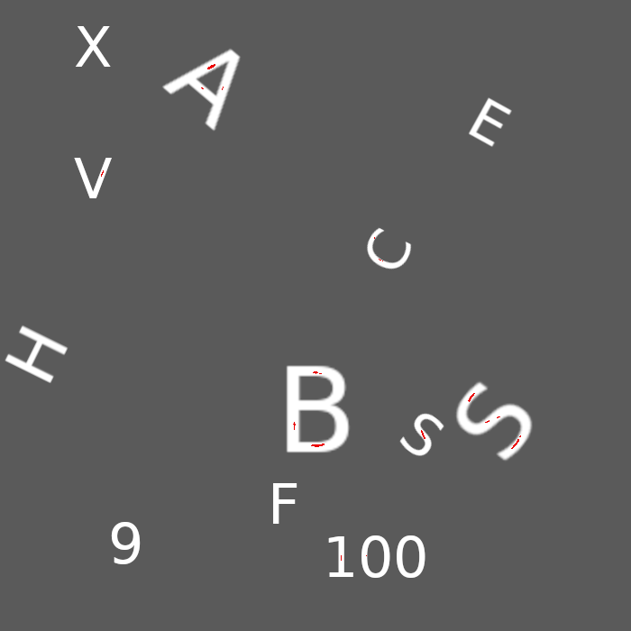

# Implementation of Ciratefi using ATen & OpenCV
Original paper: https://link.springer.com/content/pdf/10.1007/978-3-540-77129-6_13.pdf

# Test
### Image

### Template

### 1st Grade Pixels

### 2nd Grade Pixels

## Requirements
- OpenCV
- OpenMP
- Torch (because `at` is the best C++ tensor library)
- fmt (not really)

# Features
it's fast.

## TODO
- double check implementation of normalized cross correlation in template matcher
- implement masking